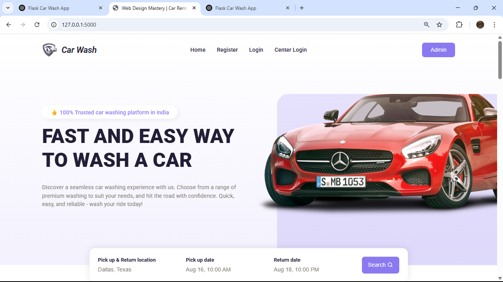
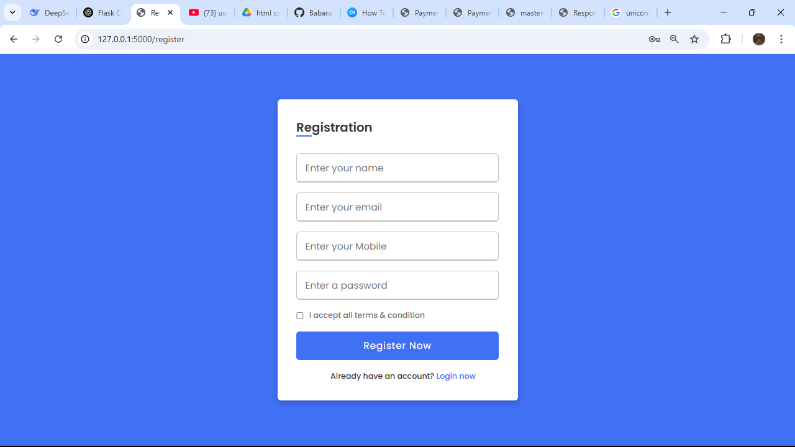
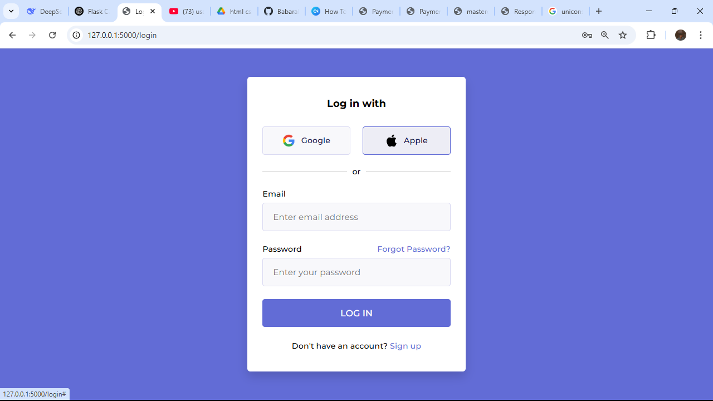
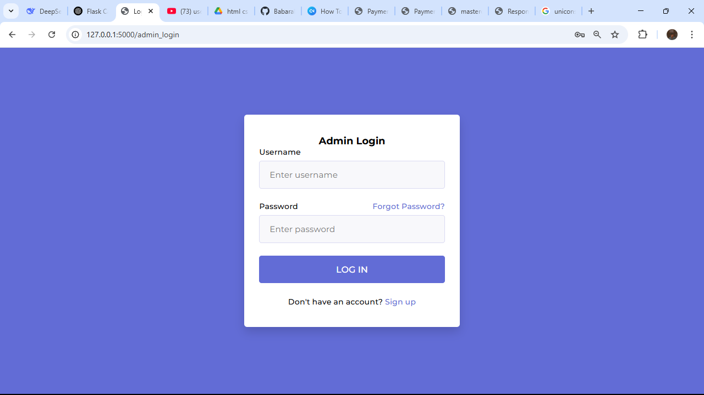
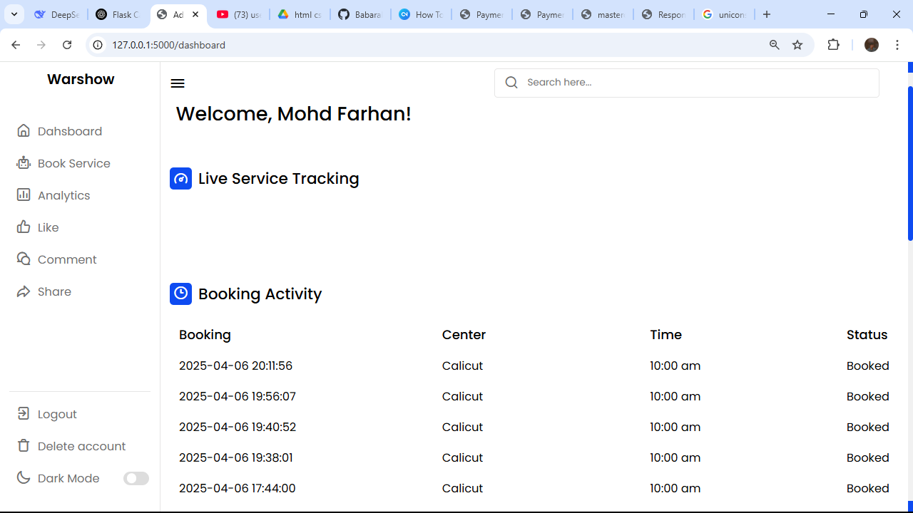
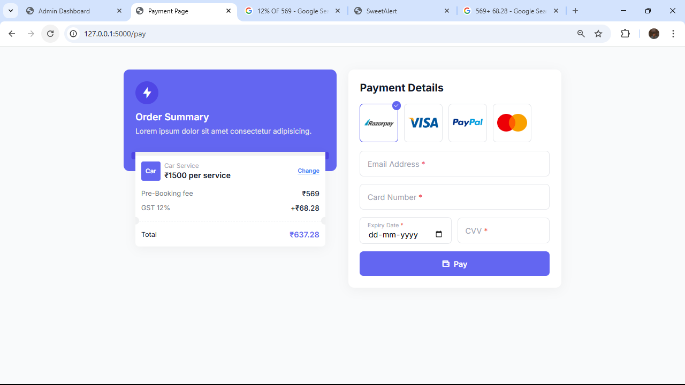
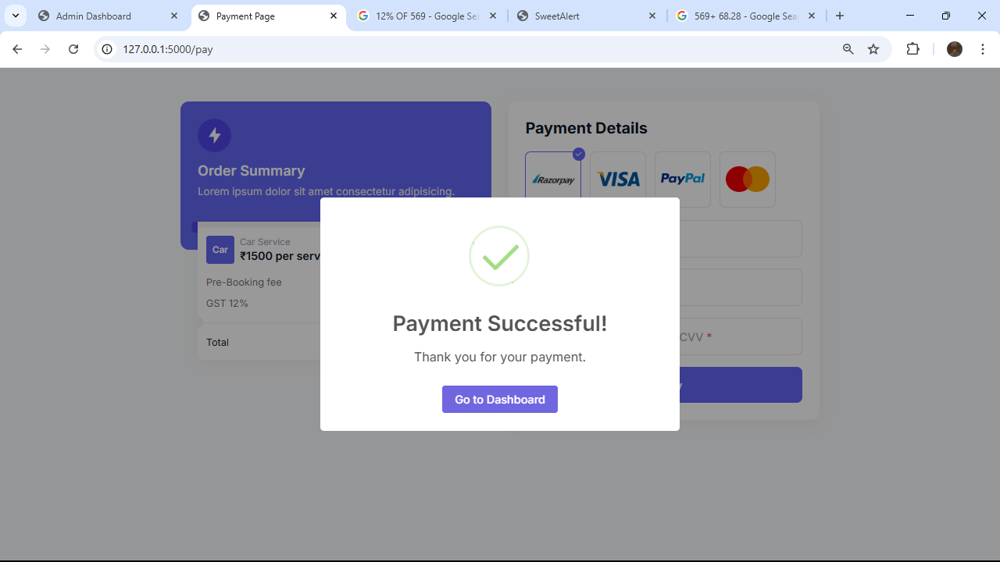
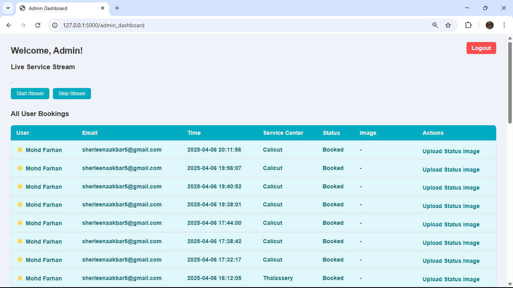
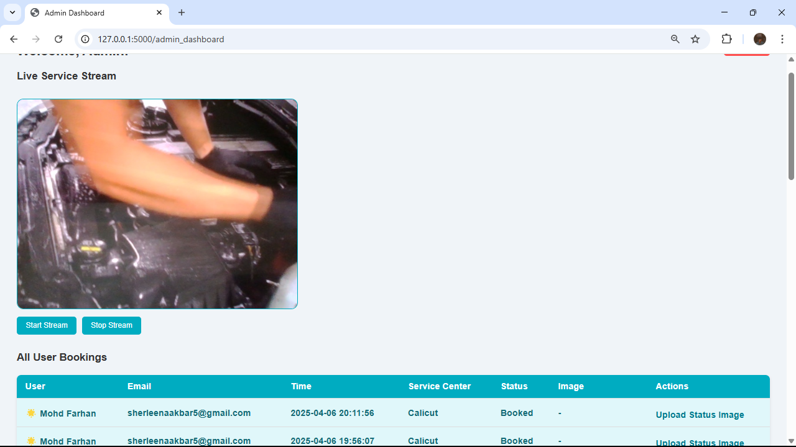
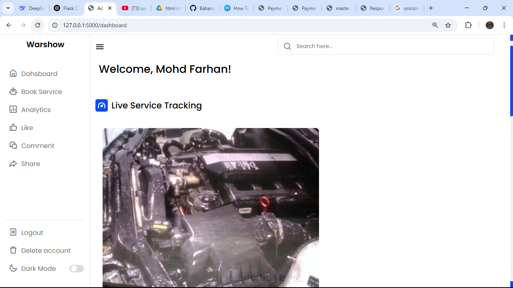

```markdown
# 🚗 Car Wash Booking Web Application

This is a full-stack Car Wash Booking Web Application built using **Flask**, **MySQL**, and **HTML/CSS/JS**, integrated with a **Chatbot Interface** for user interaction. The application allows users to book car wash services, choose service centers, and view live admin video streams and service status with images.

---

## 📌 Features

- 🔐 User & Admin Registration/Login
- 💬 Chatbot-based Booking Interface
- 📍 Location-based Service Center Selection
- 🕒 Slot Booking System
- 📷 Admin Upload of Car Service Images
- 📡 Live Video Streaming (Admin to Users)
- 💾 Data stored in MySQL database

---

## 🛠️ Tech Stack

| Layer       | Technology     |
|------------|----------------|
| Backend     | Python (Flask) |
| Frontend    | HTML, CSS, JS  |
| Database    | MySQL          |
| Streaming   | OpenCV + Flask |
| Chatbot     | Python logic   |

---

## 🗂️ Project Structure

car-wash-app/
│
├── static/
│   └── css, js, uploads/
├── templates/
│   └── *.html files
├── app.py
├── camera.py
├── chatbot.py
├── config.py
├── README.md
├── database.py
└── requirements.txt
```

---

## ⚙️ MySQL Database Setup (via Command Line)

### 1. Login to MySQL

```bash
mysql -u root -p
```

Enter your MySQL password when prompted.

### 2. Create Database

```sql
CREATE DATABASE carwashing12345;
```

### 3. Use the Database

```sql
USE carwashing12345;
```

### 4. Create Required Tables

```sql
CREATE TABLE users (
    id INT AUTO_INCREMENT PRIMARY KEY,
    username VARCHAR(100) NOT NULL,
    password VARCHAR(100) NOT NULL,
    email VARCHAR(100) NOT NULL
);

CREATE TABLE admins (
    id INT AUTO_INCREMENT PRIMARY KEY,
    username VARCHAR(100) NOT NULL,
    password VARCHAR(100) NOT NULL,
    email VARCHAR(100) NOT NULL
);

CREATE TABLE centers (
    id INT AUTO_INCREMENT PRIMARY KEY,
    name VARCHAR(100),
    location VARCHAR(100),
    phone VARCHAR(15)
);

CREATE TABLE slots (
    id INT AUTO_INCREMENT PRIMARY KEY,
    center_id INT,
    slot_time VARCHAR(50),
    is_booked BOOLEAN DEFAULT FALSE
);

CREATE TABLE bookings (
    id INT AUTO_INCREMENT PRIMARY KEY,
    user_id INT,
    center_id INT,
    slot_id INT,
    booking_date DATE,
    status VARCHAR(50)
);

CREATE TABLE service_status (
    id INT AUTO_INCREMENT PRIMARY KEY,
    booking_id INT,
    image_url VARCHAR(255),
    status TEXT
);
```

---

## 🚀 How to Run the App

### 1. Clone the Repository

```bash
git clone https://github.com/yourusername/car-wash-app.git
cd car-wash-app
```

### 2. Install Dependencies

```bash
pip install -r requirements.txt
```

### 3. Set Up MySQL Database

Follow the steps in the **MySQL Setup** section above.

### 4. Run the App

```bash
python app.py
```

The application will be live at `http://127.0.0.1:5000/`.

---

## 📡 Live Video Streaming Setup (Admin Only)

Admins can stream live video from their camera using the admin dashboard. Users will see the video stream live in their user dashboards.

- Implemented using **OpenCV + Flask**.
- Streaming URL: `/video_feed` route

---

## 💡 Future Improvements

- Email/SMS Notifications
- Payment Gateway Integration
- User Feedback & Ratings
- Admin Analytics Dashboard

---

## 📷 Screenshots

### Home


### Registration 


### User Login


### Admin Login


### User Dashboard 


### Chat BOT


### Payment 


### Payment Success


### Admin Dashboard 


### Admin Live


### Live In User



---

## 📬 Contact

For queries or contributions, contact:  
**Your Name**  
Email: muhammedfarhankk137@gmail.com
GitHub: [yourusername](https://github.com/yourusername)
Contact No: +91 8848523864

---

```

