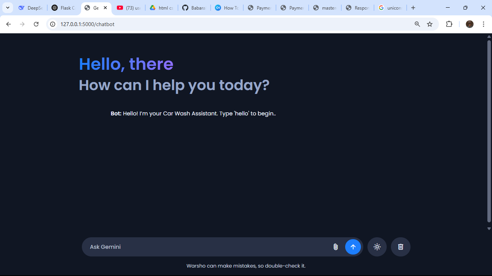

# 🚗 Car Wash Booking Web Application
## Python 3.13.1 (important)

### This is a full-stack Car Wash Booking Web Application built using **Flask**, **MySQL**, and **HTML/CSS/JS**, integrated with a **Chatbot Interface** for user interaction. The application allows users to book car wash services, choose service centers, and view live admin video streams and service status with images.

### Live Webiste Preview [Live](https://car-washing-bot-webapp-client.onrender.com/)


## 📌 Features

- 🔐 User & Admin Registration/Login
- 💬 Chatbot-based Booking Interface
- 📍 Location-based Service Center Selection
- 🕒 Slot Booking System
- 📷 Admin Upload of Car Service Images
- 📡 Live Video Streaming (Admin to Users)
- 💾 Data stored in MySQL database

---

## 🛠️ Tech Stack

| Layer       | Technology     |
|------------|----------------|
| Backend     | Python (Flask) |
| Frontend    | HTML, CSS, JS  |
| Database    | MySQL          |
| Streaming   | OpenCV + Flask |
| Chatbot     | Python logic   |

---

## 🗂️ Project Structure
```markdown
car-wash-app/
│
├── static/
│   └── css, js, uploads/
├── templates/
│   └── *.html files
├── app.py
├── camera.py
├── chatbot.py
├── config.py
├── README.md
├── database.py
└── requirements.txt
```
---
## 🧰 How to Install MySQL Command Line Client
To run MySQL commands from the terminal (like creating databases and tables), follow the steps below to install MySQL on your system:


### 🛠️ Installation Steps
Go to the official MySQL Installer page:
#### 🔗 Download MySQL Installer
 https://dev.mysql.com/downloads/installer/

#### 1. Download the appropriate version:

Choose MySQL Installer for Windows (Web or Full version).

#### 2. Run the Installer:

Choose "Developer Default" setup to install MySQL Server, MySQL Workbench, and MySQL Shell.

#### 3. Follow the Setup Wizard:

- Accept the license.

- Let it install the required dependencies.

- Choose MySQL Server version (8.x recommended).

- Set the root password when prompted and remember it!

- Complete the Configuration:

- Set port to default (3306).

- Configure the MySQL server to run as a Windows Service.

- Complete the installation and finish setup.

- Open MySQL Command Line Client:

- Search for “MySQL Command Line Client” in the Start Menu.


---

## ⚙️ MySQL Database Setup (via Command Line)

### 1. Login to MySQL

Enter your MySQL password when prompted.

### 2. Create Database

```sql
CREATE DATABASE carwashing12345;
```

### 3. Use the Database

```sql
USE carwashing12345;
```

### 4. Create Required Tables

```sql
CREATE TABLE users (
    id INT AUTO_INCREMENT PRIMARY KEY,
    username VARCHAR(100) NOT NULL,
    password VARCHAR(100) NOT NULL,
    email VARCHAR(100) NOT NULL
);

CREATE TABLE admins (
    id INT AUTO_INCREMENT PRIMARY KEY,
    username VARCHAR(100) NOT NULL,
    password VARCHAR(100) NOT NULL,
    email VARCHAR(100) NOT NULL
);

CREATE TABLE centers (
    id INT AUTO_INCREMENT PRIMARY KEY,
    name VARCHAR(100),
    location VARCHAR(100),
    phone VARCHAR(15)
);

CREATE TABLE slots (
    id INT AUTO_INCREMENT PRIMARY KEY,
    center_id INT,
    slot_time VARCHAR(50),
    is_booked BOOLEAN DEFAULT FALSE
);

CREATE TABLE bookings (
    id INT AUTO_INCREMENT PRIMARY KEY,
    user_id INT,
    center_id INT,
    slot_id INT,
    booking_date DATE,
    status VARCHAR(50)
);

CREATE TABLE service_status (
    id INT AUTO_INCREMENT PRIMARY KEY,
    booking_id INT,
    image_url VARCHAR(255),
    status TEXT
);
```

---

## 🚀 How to Run the App

### 1. Clone the Repository

```bash
git clone https://github.com/farhan123mohd/Car-washing-Bot-webapp-client.git
cd car-washing-Bot-webapp-client
```

### 2. Create Virtual Environment
Open the Terminal within Visual Studio (you can find it by going to View > Terminal or View > Other Windows > Terminal).
```bash
python -m venv venv
```
Once the virtual environment is created, you can activate it by running:

```bash
.\venv\Scripts\activate

```
### 3. Install Dependencies

```bash
pip install -r requirements.txt
```

### 4. Set Up MySQL Database

Follow the steps in the **MySQL Setup** section above.

### 5. Run the App

```bash
python app.py
```

The application will be live at `http://127.0.0.1:5000/`.

---

## 📡 Live Video Streaming Setup (Admin Only)

Admins can stream live video from their camera using the admin dashboard. Users will see the video stream live in their user dashboards.

- Implemented using **OpenCV + Flask**.
- Streaming URL: `/video_feed` route

---

## 💡 Future Improvements

- Email/SMS Notifications
- Payment Gateway Integration
- User Feedback & Ratings
- Admin Analytics Dashboard

---

## 📷 Screenshots

### 1. Home


### 2. Registration 


### 3. User Login


### 4. Admin Login


### 5. User Dashboard 


### 6. Chat BOT


### 7. Payment 


### 8. Payment Success


### 9. Admin Dashboard 


### 10. Admin Live


### 11. Live In User


---

## 📬 Contact

For queries or contributions, contact:  
**Your Name**  
Email: muhammedfarhankk137@gmail.com
GitHub: [Mohammed Farhan K.K](https://github.com/farhan123mohd)
Contact No: +91 8848523864

---

```

